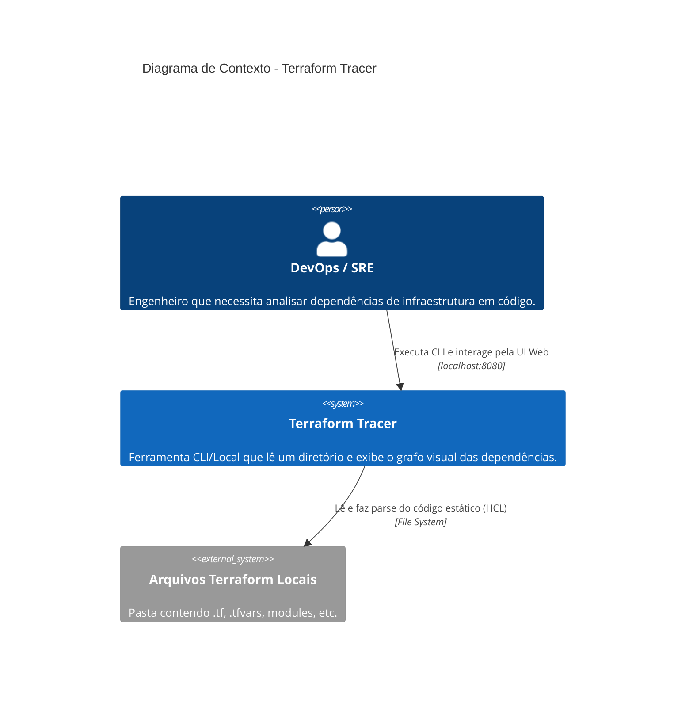
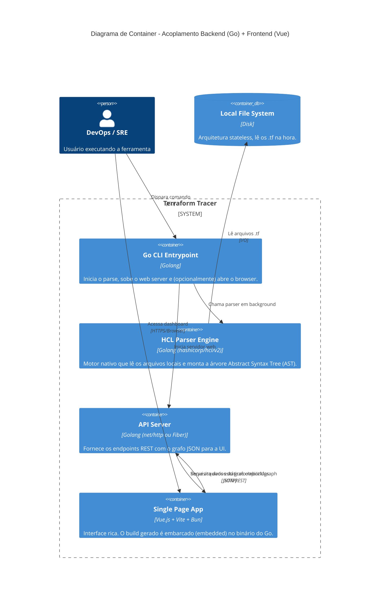

# Arquitetura de Componentes

Este documento descreve a arquitetura do sistema **Terraform Tracer** utilizando o modelo C4 (Contexto e Containers). A decisão arquitetural atualizada foca em um **Monorepo Acoplado**, utilizando **Golang** no backend (para aproveitar bibliotecas nativas como `hashicorp/hcl`) e **Vue.js** empacotado pelo **Bun** no frontend.

## Diagrama de Contexto (C4 Nível 1)

## Diagrama de Containers (C4 Nível 2)

## Decisões Arquiteturais:
1. **Linguagem Backend (Golang):** Substituímos o Python por Go. O ecossistema Go é nativo da Hashicorp. Usar a library `hashicorp/hcl/v2` elimina a precisão frágil de *Regex* e a necessidade de reinventar a roda em Python.
2. **Frontend (Vue via Bun):** O frontend será reativo, utilizando o Vue.js por sua clareza e separação limpa de componentes. O gerenciador de pacotes e empacotador será o **Bun**, para builds ultra-rápidos e leves. 
3. **Distribuição (Embed):** Com as funcionalidades do Go 1.16+ (`go:embed`), a pasta de build do *Vue* (`dist/`) poderá ser compilada dentro de um único arquivo executável binário final. Isso é excelente para a distribuição (o SRE só precisa baixar um arquivo `tracer-linux-amd64` e rodar).
