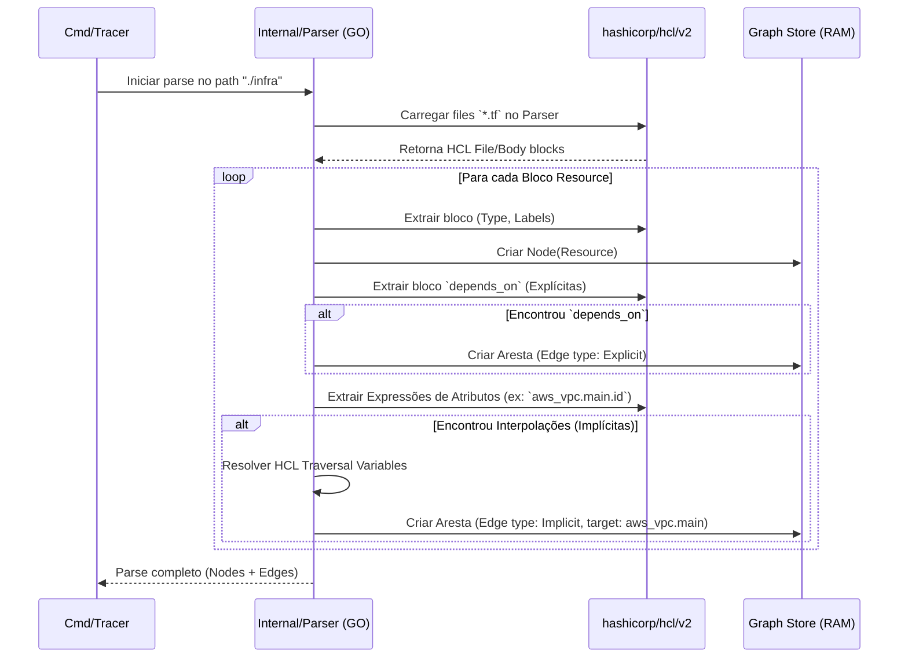

# Diagrama de Sequência - Extração de Dependências

Este diagrama detalha a parte mais crítica e complexa: como o backend de Go interpreta o HCL para achar de quem um recurso depende (*Edges* implícitas e explícitas).

