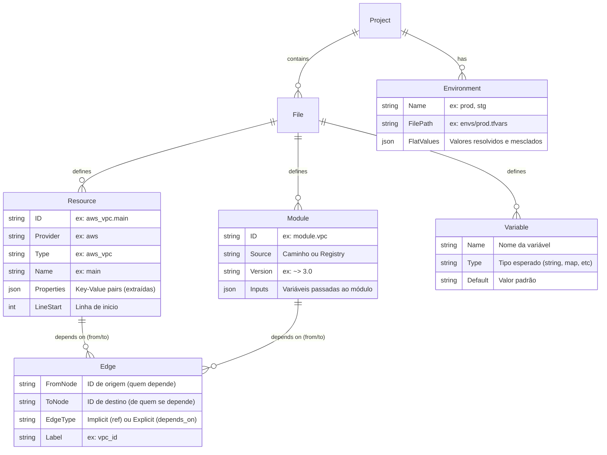

# Modelo de Dados do Parser (AST)

Aqui definimos o modelo lógico que o backend GO e a lib `hashicorp/hcl/v2` extrairão e serializarão em JSON para o Frontend.

O Frontend receberá um JSON plano otimizado contendo as listas `nodes` (unindo *Resources* e *Modules*) e `edges`, combinando com os valores por *Environment* em formato de dicionário de lookup.
